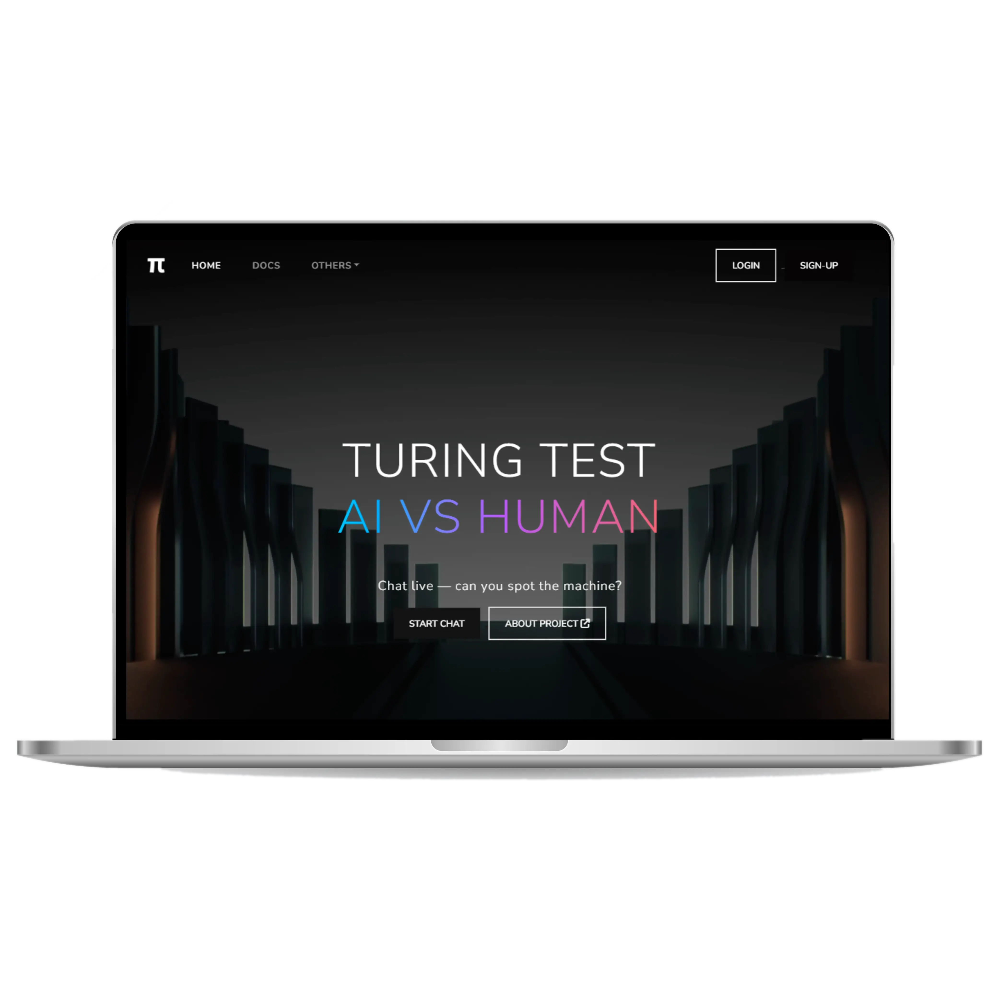

<a name="readme-top"></a>

[![Contributors][contributors-shield]][contributors-url]
[![Forks][forks-shield]][forks-url]
[![Stargazers][stars-shield]][stars-url]
[![Issues][issues-shield]][issues-url]
[![MIT License][license-shield]][license-url]
[![LinkedIn][linkedin-shield]][linkedin-url]

<!-- PROJECT LOGO -->
<br />
<div align="center">
  <a href="https://github.com/SAGAR-TAMANG/turing-test-ai-vs-human">
    
  </a>

<h3 align="center">Turing Test — AI vs Human</h3>

  <p align="center">
    A real‑time chat application that lets you talk to <em>someone</em> — but is it a human or an AI?  
    Built with Django, Channels & HTMX.  
    <br /><br />
    <a href="https://github.com/SAGAR-TAMANG/turing-test-ai-vs-human/issues">Report Bug</a>
    ·
    <a href="https://github.com/SAGAR-TAMANG/turing-test-ai-vs-human/issues">Request Feature</a>
  </p>
</div>

---

## Screenshots

| Conversation view | Mobile responsive |
| :---------------: | :---------------: |
|  |  |

<details>
  <summary>Table of Contents</summary>

- [About the Project](#about-the-project)
- [Built With](#built-with)
- [Getting Started](#getting-started)
- [Usage](#usage)
- [Roadmap](#roadmap)
- [Contributing](#contributing)
- [License](#license)
- [Contact](#contact)
- [Acknowledgments](#acknowledgments)
</details>

## About the Project

This repository contains a small Django/Channels demo inspired by Alan Turing’s famous question:  

> *“Can a machine’s answers be distinguished from a human’s?”*

Users enter a chat room and exchange messages.  
Behind the curtain the “other side” is chosen dynamically:

- **`HumanChatConsumer`** – relays messages to a real human “witness”.  
  Messages arrive in two phases: a quick *typing placeholder* followed by the final response, so the UI feels natural.
- **`ChatConsumerDemo`** – streams the reply token‑by‑token from an LLM (the SUTRA model by TWO AI in this example).

Because both pathways share the exact front‑end markup, the end‑user never knows which entity is replying — perfect for a casual Turing‑test‑style game.

All development tasks are finished and the app is live on **Railway.app**.

<p align="right">(<a href="#readme-top">back to top</a>)</p>

### Built With

| Stack | Role |
| ----- | ---- |
| **Python 3 + Django 4** | Core web framework |
| **Django Channels 4** | WebSocket support |
| **HTMX** (`hx-ext="ws"`) | Simple, dependency‑free real‑time front‑end |
| **Bootstrap 5 & FontAwesome** | Styling & icons |
| **SUTRA (model, TWO AI)** | Assamese‑capable LLM (streaming responses) |
| **Railway.app** | Hosting |

<p align="right">(<a href="#readme-top">back to top</a>)</p>

## Getting Started

Follow these steps to run the project locally.

### Prerequisites

- Python 3.10 +
- `pip` & `virtualenv` (recommended)
- An API key for TWO AI’s SUTRA (or replace with your own provider)
- PostgreSQL (if you plan on using the prod settings)

### Installation

1. **Clone** the repo

   ```bash
   git clone https://github.com/SAGAR-TAMANG/turing-test-ai-vs-human.git
   cd turing-test-ai-vs-human
   ```

2. **Create** and activate a virtual environment

   ```bash
   python -m venv venv
   source venv/bin/activate   # Windows: venv\Scripts\activate
   ```

3. **Install** Python dependencies

   ```bash
   pip install -r requirements.txt
   ```

4. **Add** a `.env` file at the project root

   ```dotenv
   # .env
   DJANGO_SECRET_KEY=change-me
   SUTRA_API_KEY=your_sutra_key_here
   DEBUG=True
   ```

   > ⚠️  For production you’ll also need DB credentials (`DBNAME`, `DBUSER`, etc.).

5. **Run** the development server

   ```bash
   python manage.py migrate
   python manage.py runserver
   ```

6. **Open** <http://localhost:8000> and start chatting!  
   Visit `/human-chat/101/` in a second tab or device to join as the “witness”.

<p align="right">(<a href="#readme-top">back to top</a>)</p>

## Usage

| Endpoint | Purpose |
| -------- | ------- |
| `/` | Landing page with intro animations (GSAP) |
| `/app/` | Single‑page demo that pairs you with *either* the AI *or* a human |
| `/human-chat/<room_name>/` | Direct room URL (used by human witnesses) |
| `/ws/human-chat/<room_name>/` | WebSocket endpoint handled by `HumanChatConsumer` |

Key hot‑reload events are handled with HTMX:

```js
document.body.addEventListener('htmx:wsAfterSend', scrollToBottom);
document.body.addEventListener('htmx:wsAfterMessage', scrollToBottom);
```

The server alternates turns per room (`turn_counter:<room>`) and stores the
`contents_div_id` in the cache so *both* halves of the AI placeholder/final pair
share the same DOM container — even when they arrive from different sockets.

<p align="right">(<a href="#readme-top">back to top</a>)</p>

## Roadmap

- [x] Real‑time chat with turn‑based placeholder/final messages  
- [x] Stream LLM responses token‑by‑token  
- [ ] Switchable models (OpenAI GPT‑4o, Gemini 1.5, etc.) via env flag  
- [ ] Add scoring screen so users guess “Human” or “AI” after each chat  
- [ ] Dockerfile & GitHub Actions CI  

See the [open issues] for full backlog.

<p align="right">(<a href="#readme-top">back to top</a>)</p>

## Contributing

Contributions are **very welcome**!  

```bash
# clone & set upstream
git clone https://github.com/SAGAR-TAMANG/turing-test-ai-vs-human.git
cd turing-test-ai-vs-human
git checkout -b feat/my-awesome-change
# hack, commit, push
git push origin feat/my-awesome-change
```

Open a pull request and describe your changes — screenshots/gifs encouraged.  
If you like the project, ⭐ it on GitHub!

<p align="right">(<a href="#readme-top">back to top</a>)</p>

## License

Distributed under the MIT License.  
See [`LICENSE`](LICENSE) for details.

<p align="right">(<a href="#readme-top">back to top</a>)</p>

## Contact

**Sagar Tamang**  
📧 sagar.bdr0000@gmail.com · 🌐 [LinkedIn](https://www.linkedin.com/in/sagar-tmg/)

Project Link: <https://github.com/SAGAR-TAMANG/turing-test-ai-vs-human>

<p align="right">(<a href="#readme-top">back to top</a>)</p>

## Acknowledgments

- **TWO AI** for the SUTRA Assamese language model  
- **Django Channels** & **HTMX** for making real‑time Django straightforward  
- **Railway.app** for free hosting credits during development  

<p align="right">(<a href="#readme-top">back to top</a>)</p>

<!-- MARKDOWN LINKS & IMAGES -->
[contributors-shield]: https://img.shields.io/github/contributors/SAGAR-TAMANG/turing-test-ai-vs-human.svg?style=for-the-badge
[contributors-url]: https://github.com/SAGAR-TAMANG/turing-test-ai-vs-human/graphs/contributors
[forks-shield]: https://img.shields.io/github/forks/SAGAR-TAMANG/turing-test-ai-vs-human.svg?style=for-the-badge
[forks-url]: https://github.com/SAGAR-TAMANG/turing-test-ai-vs-human/network/members
[stars-shield]: https://img.shields.io/github/stars/SAGAR-TAMANG/turing-test-ai-vs-human.svg?style=for-the-badge
[stars-url]: https://github.com/SAGAR-TAMANG/turing-test-ai-vs-human/stargazers
[issues-shield]: https://img.shields.io/github/issues/SAGAR-TAMANG/turing-test-ai-vs-human.svg?style=for-the-badge
[issues-url]: https://github.com/SAGAR-TAMANG/turing-test-ai-vs-human/issues
[license-shield]: https://img.shields.io/github/license/SAGAR-TAMANG/turing-test-ai-vs-human.svg?style=for-the-badge
[license-url]: https://github.com/SAGAR-TAMANG/turing-test-ai-vs-human/blob/master/LICENSE
[linkedin-shield]: https://img.shields.io/badge/-LinkedIn-black.svg?style=for-the-badge&logo=linkedin&colorB=555
[linkedin-url]: https://www.linkedin.com/in/sagar-tmg/